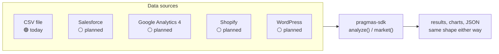

# pragmas-sdk

**The Python client for financial analysis and market research that runs on
your own machine — no account required.**

[](https://pypi.org/project/pragmas-sdk/)
[](https://pypi.org/project/pragmas-sdk/)
[](https://opensource.org/licenses/MIT)

## What is PRAGMAS?

[PRAGMAS](https://pragmas.io) is a platform that turns a company's own
documents and data into answers and ready-to-share reports, without anyone
having to write SQL, build a dashboard, or learn a BI tool. Point it at your
data, ask a question in plain language, get a report back.

**This package is one piece of that platform, not the whole thing** — the
piece you can use right now, for free, with nothing to sign up for.
`pragmas-sdk` is a Python client that runs a handful of PRAGMAS'
financial-analysis templates and its public-research tool directly in your
own code. No PRAGMAS account, no API key, no data ever sent to a PRAGMAS
server. The rest of the platform — a conversational agent grounded in your
documents, automatic ingestion, generated PDF/PPTX reports — is a separate,
closed-source, hosted product that this SDK will grow into a client for
later (see [What's next](#whats-next)). If you'd rather have a terminal
command than write Python, see
[`pragmas-cli`](https://github.com/pragmasg/pragmas-cli), built directly on
top of this package.

## What does this SDK actually do, today?

Two things, both real, both running on your machine — no network call to any
PRAGMAS server for either:

```python
from pragmas_sdk import PragmasClient

client = PragmasClient()

# A 13-week cash flow projection from a CSV you already have.
result = client.analyze("cashflow.csv", "cash_flow_13w")
print(result.results["min_balance"], result.charts)

# Public research — news, benchmarks, industry data. No account needed.
market = client.market("interest rates real estate LATAM")
print(market.summary)
```

`join_waitlist()` is the one call that's actually live against the real
PRAGMAS backend today — still zero setup:

```python
client.join_waitlist("you@example.com")
```

## Install

```bash
pip install pragmas-sdk
```

Requires Python 3.9+.

## Status

`PragmasClient` is honest about what it can actually do right now. This table
is kept in sync with [`CONTRACT.md`](./CONTRACT.md), the source of truth.

| Method | Runs | Status |
|---|---|---|
| `analyze(input_csv, template, params=None, output_dir=None)` | locally | 🟢 works today, no network |
| `market(topic, max_results=5)` | locally | 🟢 works today, no network |
| `join_waitlist(email)` | `POST /waitlist` | 🟢 live in production |
| `request_beta_key(email)` | `POST /auth/beta-key` | 🟡 implemented backend-side, not deployed yet |
| `ask()`, `ingest()`, `list_projects()`, `generate_report()` | — | ⚪ not wrapped yet — raise `PragmasNotImplementedError` |

🟢 works today · 🟡 targets a real backend endpoint that isn't live in
production yet (works if you point `base_url` at a backend you're running
yourself) · ⚪ no backend contract targeted yet in this SDK.

## `analyze()` templates

`template` is one of:

- `saas_metrics`
- `ecommerce_unit_economics`
- `cash_flow_13w`
- `r:seasonality`, `r:outliers`, `r:correlations` — R-backed, require
  `Rscript` **installed on your own machine** (everything else needs nothing
  beyond `pip install`)

Never raises on bad input, an unknown template, or missing `Rscript` — check
`result.success`/`result.error` instead:

```python
result = client.analyze("orders.csv", "ecommerce_unit_economics")
if not result.success:
    print("failed:", result.error)
```

## Where the data comes from — today a CSV, next a connector

Right now, every template above needs a CSV you already have — usually
exported by hand from wherever the data actually lives (your CRM, your
e-commerce platform, your analytics tool). That manual export is the
obvious next thing to remove: connect the SDK straight to the source instead
of exporting a file first.



**None of the connectors above exist yet — this is a roadmap, not a feature
list.** What's real today: a generic, configurable REST connector already
exists in the PRAGMAS backend (point it at any REST API's base URL, auth,
and endpoints), built for the agent, currently degraded by an unrelated
dependency-version conflict. What's planned for this SDK specifically is
purpose-built, named connectors — no generic config, just
`client.analyze_shopify(...)`-shaped calls that know the platform's data
model well enough to map it straight into `ecommerce_unit_economics`,
`saas_metrics`, and the rest without you writing any mapping code:

- **Salesforce** — pipeline and deal data
- **Google Analytics 4** — traffic and conversion data
- **Shopify** — orders, products, and customers, straight into
  `ecommerce_unit_economics`
- **WordPress** — content and traffic data

Exact shape (local, like `analyze()`/`market()`, or backend-assisted for the
platforms that need OAuth) isn't decided yet.
[Tell us which one you'd actually use first](https://github.com/pragmasg/pragmas-cli/issues).

## Response shapes

Pydantic models, so you get autocomplete and validation for free.
`AnalysisResult`, from `client.analyze("cashflow.csv", "cash_flow_13w")`:

```json
{
  "success": true,
  "module": "cash_flow_13w",
  "results": { "weeks": 13, "min_balance": -1000.0 },
  "charts": ["/tmp/pragmas_analysis_xyz/cash_flow_13w.png"],
  "error": null
}
```

`MarketResult`, from `client.market("real estate LATAM")`:

```json
{
  "topic": "real estate LATAM",
  "summary": "Rates trending down.",
  "sources": [
    { "title": "Reuters", "url": "https://example.com", "snippet": "..." }
  ],
  "generated_at": "2026-08-12T00:00:00+00:00",
  "error": null
}
```

## Error handling

`analyze()` and `market()` never raise for a bad result — they run locally
and always return a model, so check `.error`/`.success` (shown above). The
two methods that go over the network (`join_waitlist`, `request_beta_key`)
raise real exceptions instead, each a subclass of `PragmasError` so you can
catch precisely:

```python
from pragmas_sdk import PragmasConnectionError, PragmasAPIError

try:
    client.request_beta_key("you@example.com")
except PragmasConnectionError:
    ...  # network/DNS/timeout — API unreachable
except PragmasAPIError:
    ...  # any other 4xx/5xx from the backend
```

`PragmasAuthError` (401/403) and `PragmasRateLimitError` (429) round out the
set. `PragmasNotImplementedError` is raised client-side, before any request
goes out, for methods that don't target a shipped endpoint yet.

## What's next

Once a real backend is live in production and the agent/RAG path has been
verified end-to-end, this SDK grows real methods for:

- `ask` — the conversational agent, streaming
- `ingest` — document upload (PDF/Excel/Word/PPTX/CSV)
- `list_projects`
- `generate_report` — PDF/PPTX report generation

Wrapping those before the backend can serve them would ship client methods
nobody could actually use — so they raise `PragmasNotImplementedError` for
now, on purpose, rather than being silently missing. `analyze()`/`market()`
are staying local for good, not moving to the network later — see
[CONTRACT.md](./CONTRACT.md) for why. Named connectors (Salesforce, GA4,
Shopify, WordPress — see above) are the other big piece of the roadmap,
independent of the agent work.

## Give feedback

This SDK exists to get its design right before the platform goes GA — the
fastest way to influence it is to tell us what's awkward, missing, or
surprising, including which connector you'd want first.
[Open an issue](https://github.com/pragmasg/pragmas-sdk/issues).

## Development

```bash
git clone https://github.com/pragmasg/pragmas-sdk.git
cd pragmas-sdk
pip install -e ".[dev]"
pytest
```

`analyze()` tests run for real (pandas/matplotlib, no mocking); the R-backed
templates' sandboxing/whitelist/error paths are tested without R, and a real
`Rscript` run only executes if R is installed on your machine. `join_waitlist`/
`request_beta_key` tests mock the HTTP layer with
[`respx`](https://lundberg.github.io/respx/) — no live backend required.

## Contributing

New analysis templates, bug fixes, and docs improvements are welcome.
Connectors and other new extension points aren't formalized yet — open an
issue before writing one. See [CONTRIBUTING.md](./CONTRIBUTING.md) for the
full guide: what's open today, dev setup, and the PR process.
[`pragmas-cli`](https://github.com/pragmasg/pragmas-cli) has its own
`CONTRIBUTING.md` for command/UX-level contributions.

## License

MIT — see [LICENSE](./LICENSE).
