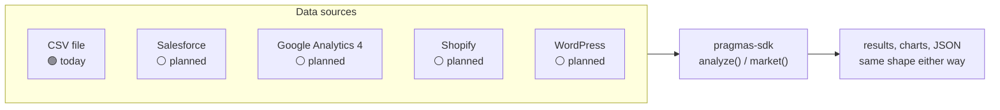

# pragmas-sdk

**The Python client for financial analysis and market research that runs on
your own machine — no account required.**

[](https://pypi.org/project/pragmas-sdk/)
[](https://pypi.org/project/pragmas-sdk/)
[](https://opensource.org/licenses/MIT)

## What is PRAGMAS?

[PRAGMAS](https://pragmas.io) is about giving anyone the same rigor a
financial analyst would apply — cash flow projections, SaaS metrics, unit
economics, cohort retention — without building a dashboard, learning a BI
tool, or writing SQL. Point it at your data, get the analysis back.

`pragmas-sdk` is the free, open-source Python client for that toolkit: a
growing library of financial-analysis templates and a public-research tool
that run entirely on your own machine. No account, no API key, no data ever
sent anywhere — install it and use it, full stop. If you'd rather have a
terminal command than write Python, see
[`pragmas-cli`](https://github.com/pragmasg/pragmas-cli), built directly on
top of this package.

## What does this SDK actually do, today?

Two things, both real, both running on your machine — no network call to any
PRAGMAS server for either:

```python
from pragmas_sdk import PragmasClient

client = PragmasClient()

# A 13-week cash flow projection from a CSV you already have.
result = client.analyze("cashflow.csv", "cash_flow_13w")
print(result.results["min_balance"], result.charts)

# Public research — news, benchmarks, industry data. No account needed.
market = client.market("interest rates real estate LATAM")
print(market.summary)
```

`join_waitlist()` is the one call that's actually live against the real
PRAGMAS backend today — still zero setup:

```python
client.join_waitlist("you@example.com")
```

## Install

```bash
pip install pragmas-sdk
```

Requires Python 3.9+.

## Status

`PragmasClient` is honest about what it can actually do right now. This table
is kept in sync with [`CONTRACT.md`](./CONTRACT.md), the source of truth.

| Method | Runs | Status |
|---|---|---|
| `analyze(input_csv, template, params=None, output_dir=None)` | locally | 🟢 works today, no network |
| `market(topic, max_results=5)` | locally | 🟢 works today, no network |
| `join_waitlist(email)` | `POST /waitlist` | 🟢 live in production |
| `request_beta_key(email)` | `POST /auth/beta-key` | 🟡 implemented backend-side, not deployed yet |
| `ask()`, `ingest()`, `list_projects()`, `generate_report()` | — | ⚪ not implemented in this SDK — raise `PragmasNotImplementedError` |

🟢 works today, fully local · 🟡 needs a backend running at `base_url` (not
publicly hosted yet — works against one you run yourself) · ⚪ not
implemented in this SDK.

## `analyze()` templates

`template` is one of:

- `saas_metrics`
- `ecommerce_unit_economics`
- `cash_flow_13w`
- `data_profile` — generic CSV profiler (no fixed required columns):
  missing values, duplicates, inferred column types, correlations, IQR
  outliers
- `sales_pipeline` — CRM deals pipeline: win rate, avg deal size, sales
  velocity, stage conversion, sales cycle, forecast
- `burn_rate_runway` — monthly burn, cash runway, scenario projections
- `cohort_analysis` — generic revenue/customer cohort retention for any
  recurring-revenue business
- `board_report` — curated board-ready summary composed from
  `saas_metrics` (no new math, same input)
- `r:seasonality`, `r:outliers`, `r:correlations` — R-backed, require
  `Rscript` **installed on your own machine** (everything else needs nothing
  beyond `pip install`)

Full list with descriptions and required columns:
`pragmas templates` / `pragmas templates show <name>` (via
[`pragmas-cli`](https://github.com/pragmasg/pragmas-cli)), or
`pragmas_sdk.analysis.list_modules()`.

Never raises on bad input, an unknown template, or missing `Rscript` — check
`result.success`/`result.error` instead:

```python
result = client.analyze("orders.csv", "ecommerce_unit_economics")
if not result.success:
    print("failed:", result.error)
```

## Where the data comes from — today a CSV, next a connector

Right now, every template above needs a CSV you already have — usually
exported by hand from wherever the data actually lives (your CRM, your
e-commerce platform, your analytics tool). That manual export is the
obvious next thing to remove: connect the SDK straight to the source instead
of exporting a file first.



**None of the connectors above exist yet — this is a roadmap, not a feature
list.** What's real today: a generic, configurable REST connector already
exists in the PRAGMAS backend (point it at any REST API's base URL, auth,
and endpoints), built for the agent, currently degraded by an unrelated
dependency-version conflict. What's planned for this SDK specifically is
purpose-built, named connectors — no generic config, just
`client.analyze_shopify(...)`-shaped calls that know the platform's data
model well enough to map it straight into `ecommerce_unit_economics`,
`saas_metrics`, and the rest without you writing any mapping code:

- **Shopify** — orders, products, and customers, straight into
  `ecommerce_unit_economics` — [demand issue #1](https://github.com/pragmasg/pragmas-sdk/issues/1)
- **HubSpot** — deals, contacts, pipeline stages — [demand issue #2](https://github.com/pragmasg/pragmas-sdk/issues/2)
- **Google Analytics 4** — traffic and conversion data — [demand issue #3](https://github.com/pragmasg/pragmas-sdk/issues/3)
- **Salesforce** — pipeline and deal data — [demand issue #4](https://github.com/pragmasg/pragmas-sdk/issues/4)

Exact shape (local, like `analyze()`/`market()`, or backend-assisted for the
platforms that need OAuth) isn't decided yet — no `Connector` interface is
designed until one of the issues above shows real demand. Tell us which one
you'd actually use, and what you'd run afterwards, on the issue itself.

## Response shapes

Pydantic models, so you get autocomplete and validation for free.
`AnalysisResult`, from `client.analyze("cashflow.csv", "cash_flow_13w")`:

```json
{
  "success": true,
  "module": "cash_flow_13w",
  "results": { "weeks": 13, "min_balance": -1000.0 },
  "charts": ["/tmp/pragmas_analysis_xyz/cash_flow_13w.png"],
  "error": null
}
```

`MarketResult`, from `client.market("real estate LATAM")`:

```json
{
  "topic": "real estate LATAM",
  "summary": "Rates trending down.",
  "sources": [
    { "title": "Reuters", "url": "https://example.com", "snippet": "..." }
  ],
  "generated_at": "2026-08-12T00:00:00+00:00",
  "error": null
}
```

## Error handling

`analyze()` and `market()` never raise for a bad result — they run locally
and always return a model, so check `.error`/`.success` (shown above). The
two methods that go over the network (`join_waitlist`, `request_beta_key`)
raise real exceptions instead, each a subclass of `PragmasError` so you can
catch precisely:

```python
from pragmas_sdk import PragmasConnectionError, PragmasAPIError

try:
    client.request_beta_key("you@example.com")
except PragmasConnectionError:
    ...  # network/DNS/timeout — API unreachable
except PragmasAPIError:
    ...  # any other 4xx/5xx from the backend
```

`PragmasAuthError` (401/403) and `PragmasRateLimitError` (429) round out the
set. `PragmasNotImplementedError` is raised client-side, before any request
goes out, for methods that don't target a shipped endpoint yet.

## What's next

This SDK's own roadmap, in order:

- More analysis templates, prioritized by real demand — see
  [open issues](https://github.com/pragmasg/pragmas-sdk/issues).
- Named data connectors (Shopify, HubSpot, GA4, Salesforce) so templates run
  straight off your existing tools instead of a manual CSV export — see
  [Where the data comes from](#where-the-data-comes-from--today-a-csv-next-a-connector)
  above.
- A universal file-adapter layer (xlsx/ods/tsv, flexible column names, header
  detection) so templates aren't limited to a CSV with exact column names.

`analyze()` and `market()` are staying local for good — that's a deliberate
choice, not a placeholder (see [CONTRACT.md](./CONTRACT.md) for the reasoning).
A handful of client methods (`ask`, `ingest`, `list_projects`,
`generate_report`) are reserved for capabilities this SDK doesn't implement
yet and raise `PragmasNotImplementedError` rather than failing silently.

## Give feedback

Tell us what's awkward, missing, or surprising — including which connector
or template you'd want first.
[Open an issue](https://github.com/pragmasg/pragmas-sdk/issues).

## Development

```bash
git clone https://github.com/pragmasg/pragmas-sdk.git
cd pragmas-sdk
pip install -e ".[dev]"
pytest
```

`analyze()` tests run for real (pandas/matplotlib, no mocking); the R-backed
templates' sandboxing/whitelist/error paths are tested without R, and a real
`Rscript` run only executes if R is installed on your machine. `join_waitlist`/
`request_beta_key` tests mock the HTTP layer with
[`respx`](https://lundberg.github.io/respx/) — no live backend required.

## Contributing

New analysis templates, bug fixes, and docs improvements are welcome.
Connectors and other new extension points aren't formalized yet — open an
issue before writing one. See [CONTRIBUTING.md](./CONTRIBUTING.md) for the
full guide: what's open today, dev setup, and the PR process.
[`pragmas-cli`](https://github.com/pragmasg/pragmas-cli) has its own
`CONTRIBUTING.md` for command/UX-level contributions.

## License

MIT — see [LICENSE](./LICENSE).
